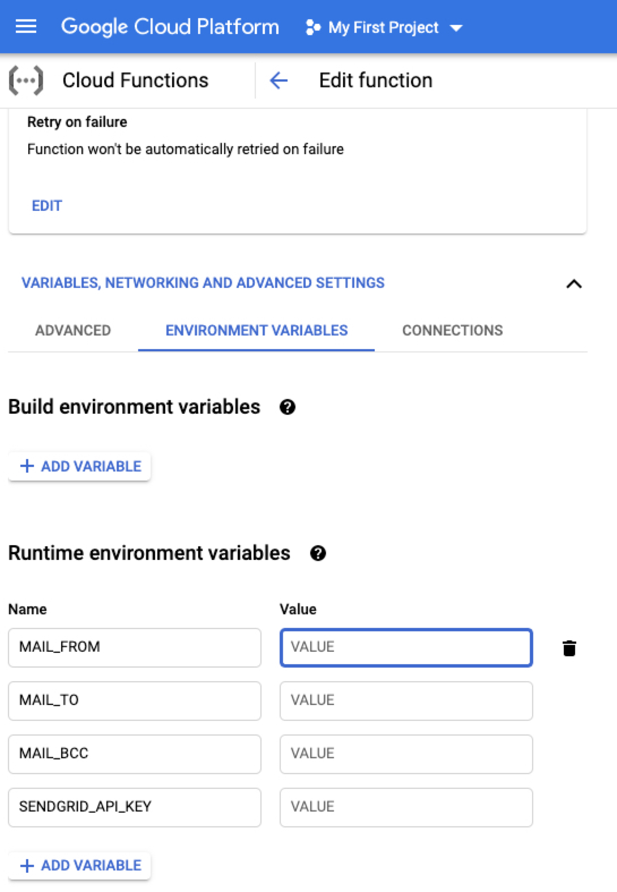
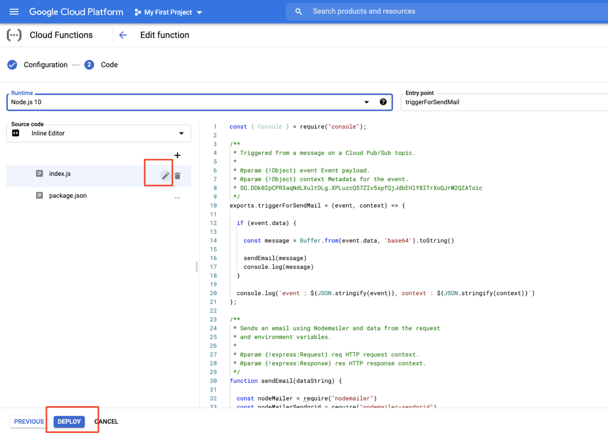
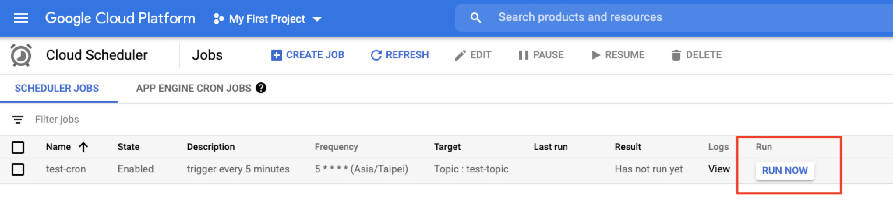
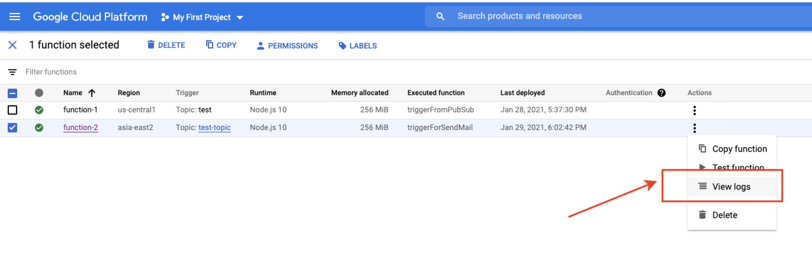
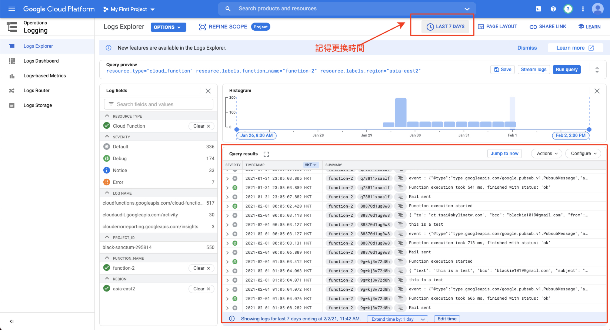

# Sample

本範例以 `node.js` 為範例

## Implement

1. 新增 Cloud Function, 如果選擇觸發來源為 [Cloud Scheduler](https://cloud.google.com/scheduler) 或是 [Pub/Sub](https://cloud.google.com/pubsub/)
2. 添加以下環境變數並將變數內的數值修改
3. 於程式碼處參考 `index.js` 與 `package.json` 的內容貼上
4. 按下`部署(deploy)`即可．

## Testing

這邊以 `Cloud Scheduler` 觸發為範例：

至 `Cloud Function` 查看執行紀錄:

